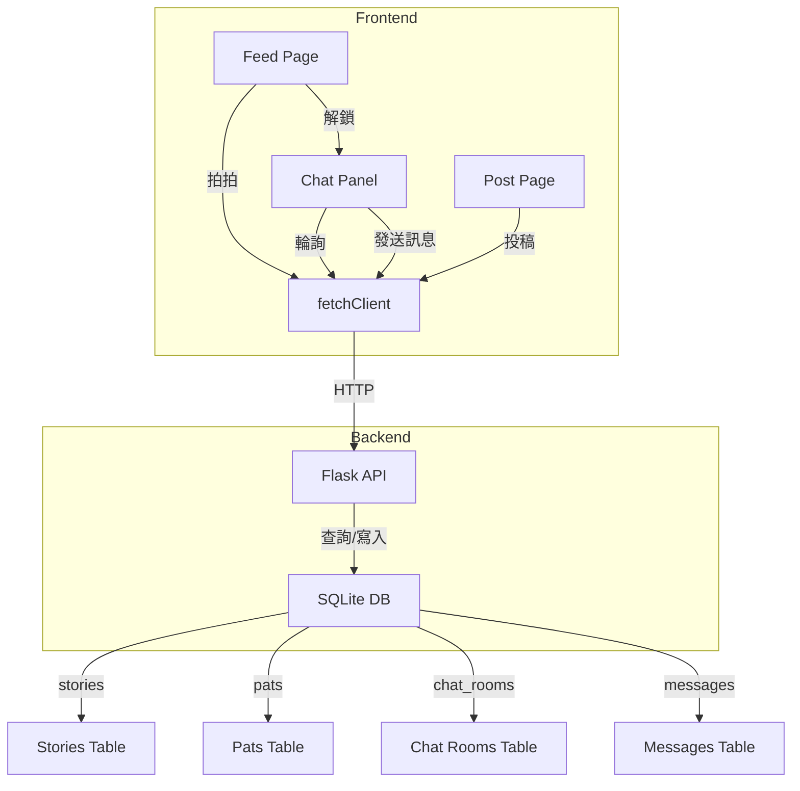
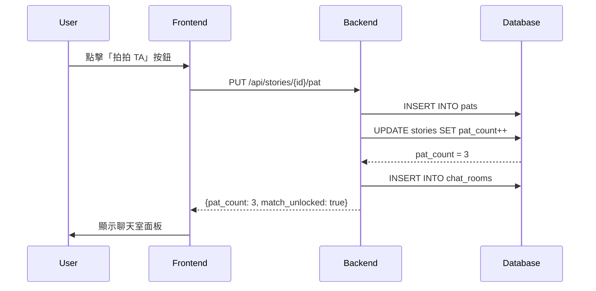
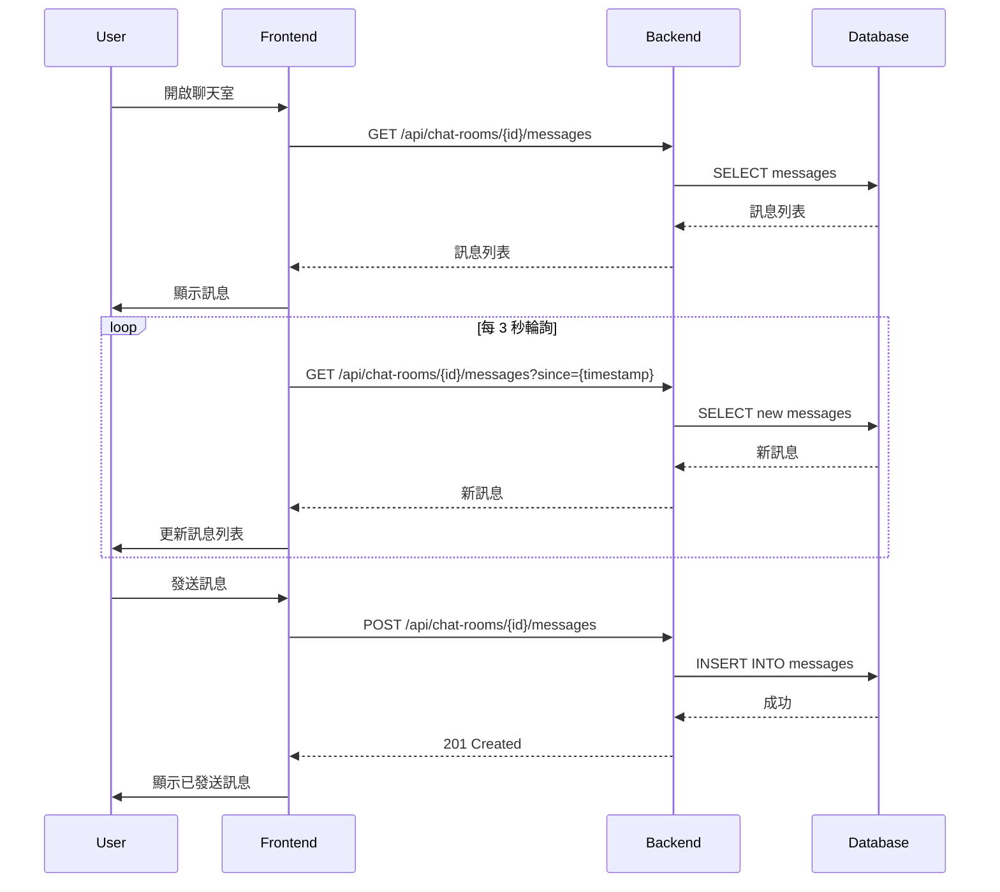
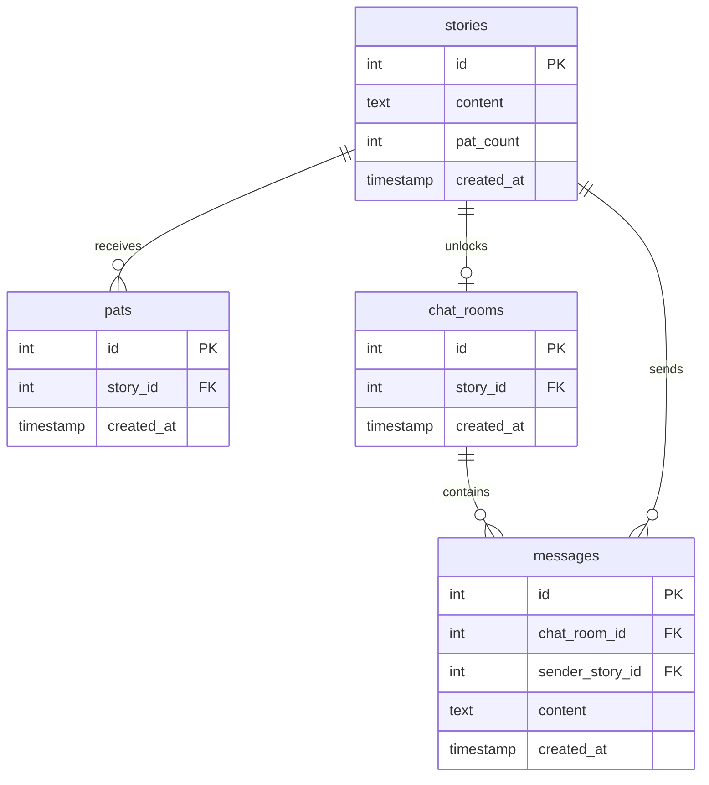

# Design Document: Developer C Interaction & Chat Feature

## Overview

本設計文件定義「魯蛇回收站」（TrashMatch）專案中開發者 C 負責的功能實作細節，包括：

1. **拍拍累積解鎖聊天室邏輯**：當慘事累積 3 個拍拍時，自動解鎖聊天室
2. **聊天室介面與訊息更新機制**：提供簡易聊天介面，使用輪詢（polling）機制更新訊息
3. **文案系統**：防呆提示與搞笑文案，強化使用者體驗
4. **系統整合測試**：驗證完整流程（發文 → 拍拍 → 聊天）
5. **預期成果文件**：描述專案價值與未來發展

### 設計目標

- **簡單可靠**：使用輪詢機制而非 WebSocket，降低技術複雜度
- **幽默體驗**：透過搞笑文案強化品牌調性
- **漸進式增強**：先實作核心功能，預留未來擴展空間（如即時通訊、配對演算法）

### 技術限制

- 前端：純 JavaScript（ES6 模組），無框架依賴
- 後端：Python Flask + SQLite
- 通訊：RESTful API + 輪詢（3 秒間隔）
- 無使用者認證系統（匿名互動）

## Architecture

### 系統架構圖



### 核心流程

#### 1. 拍拍解鎖流程



#### 2. 聊天室訊息流程



### 模組職責劃分

| 模組 | 職責 | 檔案 |
|------|------|------|
| **fetchClient** | 封裝所有 API 呼叫，處理 HTTP 請求與錯誤 | `frontend/js/fetchClient.js` |
| **feed** | Feed 頁邏輯：載入慘事、拍拍互動 | `frontend/js/feed.js` |
| **chat** | 聊天室邏輯：開啟/關閉、輪詢、發送訊息 | `frontend/js/chat.js` |
| **renderer** | UI 渲染：更新 DOM、顯示錯誤訊息 | `frontend/js/renderer.js` |
| **router** | 頁面路由與聊天室狀態管理 | `frontend/js/router.js` |
| **Flask API** | 後端 API 端點實作 | `backend/app.py` |
| **Database** | 資料持久化 | `backend/init_db.py` |

## Components and Interfaces

### Frontend Components

#### 1. Chat Panel Component

**職責**：顯示聊天室介面，管理訊息列表與輸入框

**DOM 結構**：
```html
<aside id="chat-panel" class="chat-panel hidden">
  <div class="chat-panel__header">
    <h2 class="chat-panel__title">💘 配對成功！你們都沒救了</h2>
    <button id="chat-close-btn">✕</button>
  </div>
  <div class="chat-panel__body">
    <div id="chat-messages" class="chat-messages">
      <!-- 訊息列表 -->
    </div>
  </div>
  <div class="chat-panel__footer">
    <input id="chat-input" type="text" placeholder="輸入訊息…" />
    <button id="chat-send-btn">送出</button>
  </div>
</aside>
```

**狀態管理**：
```javascript
const chatState = {
  chatRoomId: null,        // 當前聊天室 ID
  messages: [],            // 訊息列表
  lastFetchedAt: null,     // 最後一次取得訊息的時間戳
  pollingInterval: null,   // 輪詢計時器
  isSending: false,        // 發送中旗標
}
```

**公開方法**：
- `chat.init()`: 初始化聊天室模組
- `chat.open(chatRoomId)`: 開啟聊天室，開始輪詢
- `chat.close()`: 關閉聊天室，停止輪詢
- `chat.sendMessage(content)`: 發送訊息

#### 2. Feed Component (擴充)

**新增職責**：處理 `match_unlocked` 旗標，觸發聊天室開啟

**修改點**：
```javascript
// feed.js 中的 handlePat 函式
async function handlePat() {
  // ... 現有邏輯 ...
  
  if (result.data.match_unlocked) {
    // 取得或建立 chat_room_id
    const chatRoomId = await fetchClient.getChatRoomId(feedState.currentStory.id)
    router.openChat(chatRoomId)
  }
}
```

### Backend API Interfaces

#### 1. Pat Story API (擴充)

**端點**：`PUT /api/stories/{story_id}/pat`

**回應格式**（擴充）：
```json
{
  "pat_count": 3,
  "match_unlocked": true,
  "chat_room_id": 42
}
```

**邏輯變更**：
- 當 `pat_count` 達到 3 時，檢查是否已有 `chat_room` 記錄
- 若無，建立新的 `chat_room` 記錄
- 回傳 `match_unlocked: true` 與 `chat_room_id`

#### 2. Create Chat Room API

**端點**：`POST /api/chat-rooms`

**請求格式**：
```json
{
  "story_id": 123
}
```

**回應格式**：
```json
{
  "chat_room_id": 42,
  "created_at": "2025-01-15T10:30:00Z"
}
```

**驗證規則**：
- `story_id` 必須存在於 `stories` 表
- `story_id` 的 `pat_count` 必須 >= 3
- 若已有 `chat_room` 記錄，回傳現有 ID（冪等性）

#### 3. Get Messages API

**端點**：`GET /api/chat-rooms/{chat_room_id}/messages`

**查詢參數**：
- `since` (可選)：ISO 8601 時間戳，只回傳此時間之後的訊息

**回應格式**：
```json
{
  "messages": [
    {
      "id": 1,
      "sender_story_id": 123,
      "content": "你也很慘嗎？",
      "created_at": "2025-01-15T10:31:00Z"
    },
    {
      "id": 2,
      "sender_story_id": 456,
      "content": "對啊，我們都沒救了",
      "created_at": "2025-01-15T10:31:30Z"
    }
  ]
}
```

**錯誤處理**：
- 404：`chat_room_id` 不存在
- 400：`since` 參數格式錯誤

#### 4. Send Message API

**端點**：`POST /api/chat-rooms/{chat_room_id}/messages`

**請求格式**：
```json
{
  "sender_story_id": 123,
  "content": "我們一起加油吧"
}
```

**回應格式**：
```json
{
  "id": 3,
  "sender_story_id": 123,
  "content": "我們一起加油吧",
  "created_at": "2025-01-15T10:32:00Z"
}
```

**驗證規則**：
- `chat_room_id` 必須存在
- `sender_story_id` 必須是該 `chat_room` 的參與者之一
- `content` 不可為空或純空白字元
- `content` 長度限制：1-500 字元

**錯誤處理**：
- 404：`chat_room_id` 不存在
- 403：`sender_story_id` 不是該聊天室的參與者
- 400：`content` 驗證失敗

### fetchClient 擴充

新增以下方法：

```javascript
// fetchClient.js

/**
 * 取得聊天室 ID（若不存在則建立）
 */
async getChatRoomId(storyId) {
  const response = await fetch(`${API_BASE}/api/chat-rooms`, {
    method: 'POST',
    headers: { 'Content-Type': 'application/json' },
    body: JSON.stringify({ story_id: storyId }),
  })
  
  if (!response.ok) {
    return { ok: false, status: response.status }
  }
  
  const data = await response.json()
  return { ok: true, data }
}

/**
 * 取得聊天室訊息
 */
async getMessages(chatRoomId, since = null) {
  const url = new URL(`${API_BASE}/api/chat-rooms/${chatRoomId}/messages`)
  if (since) {
    url.searchParams.set('since', since)
  }
  
  const response = await fetch(url)
  
  if (!response.ok) {
    return { ok: false, status: response.status }
  }
  
  const data = await response.json()
  return { ok: true, data }
}

/**
 * 發送訊息
 */
async sendMessage(chatRoomId, senderStoryId, content) {
  const response = await fetch(`${API_BASE}/api/chat-rooms/${chatRoomId}/messages`, {
    method: 'POST',
    headers: { 'Content-Type': 'application/json' },
    body: JSON.stringify({
      sender_story_id: senderStoryId,
      content: content.trim(),
    }),
  })
  
  if (!response.ok) {
    return { ok: false, status: response.status }
  }
  
  const data = await response.json()
  return { ok: true, data }
}
```

## Data Models

### 資料庫 Schema

#### 1. stories 表（現有，無變更）

```sql
CREATE TABLE stories (
    id INTEGER PRIMARY KEY AUTOINCREMENT,
    content TEXT NOT NULL,
    pat_count INTEGER NOT NULL DEFAULT 0,
    created_at TIMESTAMP DEFAULT CURRENT_TIMESTAMP
);
```

#### 2. pats 表（現有，無變更）

```sql
CREATE TABLE pats (
    id INTEGER PRIMARY KEY AUTOINCREMENT,
    story_id INTEGER NOT NULL,
    created_at TIMESTAMP DEFAULT CURRENT_TIMESTAMP,
    FOREIGN KEY (story_id) REFERENCES stories(id)
);
```

#### 3. chat_rooms 表（新增）

```sql
CREATE TABLE chat_rooms (
    id INTEGER PRIMARY KEY AUTOINCREMENT,
    story_id INTEGER NOT NULL UNIQUE,
    created_at TIMESTAMP DEFAULT CURRENT_TIMESTAMP,
    FOREIGN KEY (story_id) REFERENCES stories(id)
);
```

**設計說明**：
- `story_id`：觸發解鎖的慘事 ID（UNIQUE 確保一個慘事只能解鎖一個聊天室）
- 簡化設計：一個慘事對應一個聊天室（未來可擴展為多對多關係）

#### 4. messages 表（新增）

```sql
CREATE TABLE messages (
    id INTEGER PRIMARY KEY AUTOINCREMENT,
    chat_room_id INTEGER NOT NULL,
    sender_story_id INTEGER NOT NULL,
    content TEXT NOT NULL,
    created_at TIMESTAMP DEFAULT CURRENT_TIMESTAMP,
    FOREIGN KEY (chat_room_id) REFERENCES chat_rooms(id),
    FOREIGN KEY (sender_story_id) REFERENCES stories(id)
);

CREATE INDEX idx_messages_chat_room_created 
ON messages(chat_room_id, created_at);
```

**設計說明**：
- `sender_story_id`：發送者的慘事 ID（用於區分對話雙方）
- `created_at`：訊息時間戳，用於排序與輪詢過濾
- 索引：加速按聊天室與時間查詢

### 資料關係圖



### 資料流範例

**場景**：使用者 A 投稿慘事 #123，使用者 B 投稿慘事 #456

1. 使用者 C 拍拍慘事 #123（第 1 次）
   - `pats` 表新增記錄：`{story_id: 123}`
   - `stories` 表更新：`pat_count = 1`

2. 使用者 D 拍拍慘事 #123（第 2 次）
   - `pats` 表新增記錄：`{story_id: 123}`
   - `stories` 表更新：`pat_count = 2`

3. 使用者 E 拍拍慘事 #123（第 3 次，解鎖）
   - `pats` 表新增記錄：`{story_id: 123}`
   - `stories` 表更新：`pat_count = 3`
   - `chat_rooms` 表新增記錄：`{story_id: 123}` → `chat_room_id = 42`
   - API 回傳：`{pat_count: 3, match_unlocked: true, chat_room_id: 42}`

4. 使用者 A 在聊天室 #42 發送訊息
   - `messages` 表新增記錄：`{chat_room_id: 42, sender_story_id: 123, content: "謝謝大家"}`

5. 使用者 F 開啟聊天室 #42
   - 查詢：`SELECT * FROM messages WHERE chat_room_id = 42 ORDER BY created_at`
   - 回傳訊息列表


## Error Handling

### 錯誤分類與處理策略

#### 1. 網路錯誤

**場景**：API 請求失敗（網路中斷、伺服器無回應）

**處理策略**：
- Frontend：顯示通用錯誤訊息，保持 UI 可操作狀態
- 不自動重試（避免無限迴圈）
- 錯誤訊息範例：
  - 拍拍失敗：「拍拍失敗，請稍後再試」
  - 訊息發送失敗：「訊息送出失敗，你的話語迷失在虛空中」
  - 聊天室載入失敗：「聊天室載入失敗，連系統都放棄你了」

**實作**：
```javascript
// fetchClient.js
async function handleFetchError(response, context) {
  if (!response.ok) {
    console.error(`API Error [${context}]:`, response.status)
    return {
      ok: false,
      status: response.status,
      error: getErrorMessage(context, response.status)
    }
  }
}

function getErrorMessage(context, status) {
  const messages = {
    'pat': '拍拍失敗，請稍後再試',
    'send_message': '訊息送出失敗，你的話語迷失在虛空中',
    'load_chat': '聊天室載入失敗，連系統都放棄你了',
    'load_story': '目前沒有慘事，快去投稿吧！',
  }
  return messages[context] || '操作失敗，請稍後再試'
}
```

#### 2. 驗證錯誤

**場景**：使用者輸入不符合規則

**處理策略**：
- Frontend：即時驗證，顯示明確錯誤訊息
- Backend：二次驗證，回傳 400 Bad Request

**驗證規則**：

| 欄位 | 規則 | 錯誤訊息 |
|------|------|----------|
| Story content | 不可為空或純空白 | 「送出失敗，你的慘事暫時無人接收」 |
| Message content | 不可為空或純空白 | 「訊息不可為空白」 |
| Message content | 長度 1-500 字元 | 「訊息長度超過限制（最多 500 字）」 |

**實作**：
```javascript
// chat.js
function validateMessage(content) {
  const trimmed = content.trim()
  
  if (!trimmed) {
    return { valid: false, error: '訊息不可為空白' }
  }
  
  if (trimmed.length > 500) {
    return { valid: false, error: '訊息長度超過限制（最多 500 字）' }
  }
  
  return { valid: true, content: trimmed }
}
```

#### 3. 狀態錯誤

**場景**：操作不符合當前狀態（如拍拍不存在的慘事）

**處理策略**：
- Backend：檢查資源存在性，回傳 404 Not Found
- Frontend：顯示友善錯誤訊息，引導使用者回到正常流程

**錯誤碼對應**：

| HTTP Status | 場景 | 錯誤訊息 |
|-------------|------|----------|
| 404 | Story 不存在 | 「拍拍失敗，請稍後再試」 |
| 404 | Chat Room 不存在 | 「聊天室不存在，請重新整理頁面」 |
| 403 | 非聊天室參與者發送訊息 | 「你不是這個聊天室的成員」 |
| 400 | 請求格式錯誤 | 「請求格式錯誤，請重新整理頁面」 |

#### 4. 輪詢錯誤

**場景**：輪詢過程中發生錯誤

**處理策略**：
- 靜默失敗：不顯示錯誤訊息（避免干擾使用者）
- 記錄錯誤到 console
- 繼續下一次輪詢（不中斷輪詢機制）

**實作**：
```javascript
// chat.js
async function pollMessages() {
  try {
    const result = await fetchClient.getMessages(
      chatState.chatRoomId,
      chatState.lastFetchedAt
    )
    
    if (result.ok && result.data.messages.length > 0) {
      appendMessages(result.data.messages)
      chatState.lastFetchedAt = result.data.messages[result.data.messages.length - 1].created_at
    }
  } catch (error) {
    // 靜默失敗，記錄錯誤但不中斷輪詢
    console.error('Polling error:', error)
  }
}
```

#### 5. 資料庫錯誤

**場景**：資料庫操作失敗（連線中斷、約束違反）

**處理策略**：
- Backend：捕捉異常，回傳 500 Internal Server Error
- 記錄詳細錯誤到伺服器日誌
- Frontend：顯示通用錯誤訊息

**實作**：
```python
# app.py
@app.route("/api/chat-rooms/<int:chat_room_id>/messages", methods=["POST"])
def send_message(chat_room_id):
    try:
        data = request.get_json(silent=True) or {}
        content = (data.get("content") or "").strip()
        sender_story_id = data.get("sender_story_id")
        
        if not content:
            return jsonify({"message": "訊息不可為空白"}), 400
        
        if len(content) > 500:
            return jsonify({"message": "訊息長度超過限制（最多 500 字）"}), 400
        
        conn = get_db_connection()
        cursor = conn.cursor()
        
        # 驗證 chat_room 存在
        cursor.execute("SELECT id FROM chat_rooms WHERE id = ?", (chat_room_id,))
        if not cursor.fetchone():
            conn.close()
            return jsonify({"message": "聊天室不存在"}), 404
        
        # 插入訊息
        cursor.execute(
            "INSERT INTO messages (chat_room_id, sender_story_id, content) VALUES (?, ?, ?)",
            (chat_room_id, sender_story_id, content)
        )
        conn.commit()
        
        message_id = cursor.lastrowid
        cursor.execute("SELECT * FROM messages WHERE id = ?", (message_id,))
        message = cursor.fetchone()
        conn.close()
        
        return jsonify({
            "id": message["id"],
            "sender_story_id": message["sender_story_id"],
            "content": message["content"],
            "created_at": message["created_at"]
        }), 201
        
    except Exception as e:
        app.logger.error(f"Error sending message: {e}")
        return jsonify({"message": "訊息送出失敗，請稍後再試"}), 500
```

### 錯誤訊息設計原則

1. **保持幽默調性**：符合「魯蛇回收站」品牌風格
2. **明確但不技術化**：避免暴露實作細節（如「資料庫連線失敗」）
3. **提供行動指引**：告訴使用者下一步該做什麼（如「請重新整理頁面」）
4. **一致性**：相同類型錯誤使用相同訊息

### 搞笑文案列表

| 場景 | 文案 |
|------|------|
| 404 頁面 | 「你的運氣跟這個網頁一樣，都不存在」 |
| 配對成功 | 「💘 配對成功！你們都沒救了」 |
| 聊天室空狀態 | 「你們都沒救了，不如聊聊吧 💬✨」 |
| 投稿成功 | 「你的慘事已送達垃圾桶，等待有緣衰鬼」 |
| 載入中 | 「載入中… 🗑️」 |
| 無慘事 | 「目前沒有慘事，快去投稿吧！」 |
| 拍拍失敗 | 「拍拍失敗，請稍後再試」 |
| 訊息失敗 | 「訊息送出失敗，你的話語迷失在虛空中」 |
| 聊天室載入失敗 | 「聊天室載入失敗，連系統都放棄你了」 |

## Testing Strategy

### 測試方法論

本專案採用**多層次測試策略**，結合單元測試、整合測試與手動測試，確保功能正確性與使用者體驗。

**不使用 Property-Based Testing (PBT) 的原因**：
- 主要功能為 UI 互動、API 整合與簡單 CRUD 操作
- 缺乏適合 PBT 的純函式與複雜輸入空間
- 使用 example-based 單元測試與整合測試更符合專案需求

### 測試層級

#### 1. 單元測試（Unit Tests）

**目標**：驗證個別函式與模組的正確性

**工具**：Vitest（前端）、pytest（後端）

**測試範圍**：

##### Frontend 單元測試

| 模組 | 測試案例 | 檔案 |
|------|----------|------|
| **fetchClient** | - 成功取得訊息<br>- 處理 404 錯誤<br>- 處理網路錯誤<br>- 正確帶入 `since` 參數 | `fetchClient.test.js` |
| **chat** | - 驗證訊息內容（空白、長度）<br>- 格式化時間戳<br>- 渲染訊息列表<br>- 開啟/關閉聊天室 | `chat.test.js` |
| **renderer** | - 渲染錯誤訊息<br>- 更新拍拍數<br>- 渲染慘事卡片 | `renderer.test.js` |

**範例測試**：
```javascript
// chat.test.js
import { describe, it, expect } from 'vitest'
import { validateMessage } from './chat.js'

describe('validateMessage', () => {
  it('應拒絕空白訊息', () => {
    const result = validateMessage('   ')
    expect(result.valid).toBe(false)
    expect(result.error).toBe('訊息不可為空白')
  })
  
  it('應拒絕超過 500 字的訊息', () => {
    const longMessage = 'a'.repeat(501)
    const result = validateMessage(longMessage)
    expect(result.valid).toBe(false)
    expect(result.error).toContain('長度超過限制')
  })
  
  it('應接受有效訊息並去除空白', () => {
    const result = validateMessage('  你好  ')
    expect(result.valid).toBe(true)
    expect(result.content).toBe('你好')
  })
})
```

##### Backend 單元測試

| 模組 | 測試案例 | 檔案 |
|------|----------|------|
| **Pat Story** | - 第 3 次拍拍解鎖聊天室<br>- 回傳正確的 `match_unlocked` 旗標<br>- 處理不存在的 story_id | `test_app.py` |
| **Send Message** | - 成功發送訊息<br>- 驗證訊息內容<br>- 處理不存在的 chat_room_id | `test_app.py` |
| **Get Messages** | - 取得所有訊息<br>- 使用 `since` 參數過濾<br>- 處理空聊天室 | `test_app.py` |

**範例測試**：
```python
# test_app.py
import pytest
from app import app, get_db_connection

@pytest.fixture
def client():
    app.config['TESTING'] = True
    with app.test_client() as client:
        yield client

def test_pat_unlocks_chat_room(client):
    # 建立測試慘事
    conn = get_db_connection()
    cursor = conn.cursor()
    cursor.execute("INSERT INTO stories (content) VALUES (?)", ("測試慘事",))
    story_id = cursor.lastrowid
    conn.commit()
    conn.close()
    
    # 拍拍 3 次
    for i in range(3):
        response = client.put(f'/api/stories/{story_id}/pat')
        data = response.get_json()
        
        if i < 2:
            assert data['match_unlocked'] == False
        else:
            assert data['match_unlocked'] == True
            assert 'chat_room_id' in data

def test_send_message_validates_content(client):
    # 建立測試聊天室
    conn = get_db_connection()
    cursor = conn.cursor()
    cursor.execute("INSERT INTO stories (content, pat_count) VALUES (?, ?)", ("測試", 3))
    story_id = cursor.lastrowid
    cursor.execute("INSERT INTO chat_rooms (story_id) VALUES (?)", (story_id,))
    chat_room_id = cursor.lastrowid
    conn.commit()
    conn.close()
    
    # 測試空白訊息
    response = client.post(f'/api/chat-rooms/{chat_room_id}/messages', json={
        'sender_story_id': story_id,
        'content': '   '
    })
    assert response.status_code == 400
    assert '空白' in response.get_json()['message']
```

#### 2. 整合測試（Integration Tests）

**目標**：驗證完整流程（發文 → 拍拍 → 聊天）

**工具**：Playwright（E2E）或手動測試

**測試場景**：

| 場景 | 步驟 | 預期結果 |
|------|------|----------|
| **完整配對流程** | 1. 投稿慘事<br>2. 拍拍 3 次<br>3. 開啟聊天室<br>4. 發送訊息 | - 聊天室成功開啟<br>- 訊息顯示在列表中 |
| **輪詢機制** | 1. 開啟聊天室<br>2. 等待 3 秒<br>3. 從另一端發送訊息 | - 新訊息自動出現 |
| **錯誤處理** | 1. 關閉後端伺服器<br>2. 嘗試發送訊息 | - 顯示錯誤訊息<br>- UI 保持可操作 |
| **聊天室持久化** | 1. 解鎖聊天室<br>2. 關閉聊天室<br>3. 重新開啟 | - 訊息歷史保留 |

**範例整合測試**（手動測試腳本）：
```markdown
### 測試案例：完整配對流程

**前置條件**：
- 後端伺服器運行中
- 資料庫已初始化

**步驟**：
1. 開啟瀏覽器，前往 `http://localhost:5000`
2. 點擊「📝 投稿」，輸入「今天被老闆罵了」，送出
3. 回到首頁，點擊「再看一個慘的」直到看到剛才的慘事
4. 點擊「拍拍 TA」3 次
5. 觀察聊天室是否自動開啟
6. 在聊天室輸入「我懂你的感受」，送出
7. 觀察訊息是否顯示在聊天室中

**預期結果**：
- ✅ 第 3 次拍拍後，聊天室面板從右側滑入
- ✅ 聊天室標題顯示「💘 配對成功！你們都沒救了」
- ✅ 訊息成功發送並顯示在聊天室中
- ✅ 訊息包含時間戳與發送者標識
```

#### 3. 手動測試（Manual Tests）

**目標**：驗證使用者體驗與視覺呈現

**測試項目**：

| 項目 | 檢查點 |
|------|--------|
| **視覺設計** | - 聊天室面板樣式正確<br>- 訊息氣泡對齊<br>- 搞笑文案顯示完整 |
| **互動體驗** | - 按鈕點擊回饋<br>- 載入狀態顯示<br>- 錯誤訊息易讀 |
| **響應式設計** | - 手機版聊天室可用<br>- 訊息列表可滾動 |
| **效能** | - 輪詢不影響 UI 流暢度<br>- 訊息列表渲染快速 |

#### 4. 回歸測試（Regression Tests）

**目標**：確保新功能不破壞現有功能

**測試範圍**：
- 投稿功能仍正常運作
- 隨機推播慘事不受影響
- 拍拍功能（不解鎖聊天室時）正常

### 測試資料準備

**資料庫初始化腳本**（測試用）：
```python
# test_data.py
import sqlite3

def setup_test_data():
    conn = sqlite3.connect("test_loser.db")
    cursor = conn.cursor()
    
    # 建立測試慘事
    test_stories = [
        "今天被老闆罵了",
        "外送送錯地址",
        "被貓嫌棄了",
    ]
    
    for content in test_stories:
        cursor.execute("INSERT INTO stories (content, pat_count) VALUES (?, ?)", (content, 0))
    
    # 建立已解鎖的聊天室
    cursor.execute("INSERT INTO stories (content, pat_count) VALUES (?, ?)", ("測試慘事", 3))
    story_id = cursor.lastrowid
    cursor.execute("INSERT INTO chat_rooms (story_id) VALUES (?)", (story_id,))
    chat_room_id = cursor.lastrowid
    
    # 建立測試訊息
    cursor.execute(
        "INSERT INTO messages (chat_room_id, sender_story_id, content) VALUES (?, ?, ?)",
        (chat_room_id, story_id, "這是測試訊息")
    )
    
    conn.commit()
    conn.close()
    print("Test data created successfully.")

if __name__ == "__main__":
    setup_test_data()
```

### 測試執行計畫

#### 開發階段
- 每次 commit 前執行單元測試
- 每日執行整合測試
- 功能完成後執行完整手動測試

#### 發布前
- 執行所有自動化測試
- 執行完整手動測試清單
- 跨瀏覽器測試（Chrome、Firefox、Safari）
- 行動裝置測試（iOS、Android）

### 測試覆蓋率目標

| 層級 | 目標覆蓋率 |
|------|-----------|
| 單元測試 | 80% 以上 |
| 整合測試 | 核心流程 100% |
| 手動測試 | 所有使用者場景 |

### 已知限制與未來改進

**當前限制**：
- 無自動化 E2E 測試（需引入 Playwright）
- 輪詢機制無壓力測試
- 無效能基準測試

**未來改進**：
- 引入 Playwright 進行自動化 E2E 測試
- 建立 CI/CD 流程自動執行測試
- 新增效能監控與警報

---

## 附錄：實作檢查清單

### Backend 實作

- [ ] 擴充 `init_db.py`：新增 `chat_rooms` 與 `messages` 表
- [ ] 修改 `PUT /api/stories/{id}/pat`：新增解鎖邏輯與 `chat_room_id` 回傳
- [ ] 實作 `POST /api/chat-rooms`：建立聊天室
- [ ] 實作 `GET /api/chat-rooms/{id}/messages`：取得訊息（含 `since` 參數）
- [ ] 實作 `POST /api/chat-rooms/{id}/messages`：發送訊息
- [ ] 新增錯誤處理與驗證邏輯
- [ ] 撰寫 Backend 單元測試

### Frontend 實作

- [ ] 擴充 `fetchClient.js`：新增聊天室相關 API 方法
- [ ] 修改 `feed.js`：處理 `match_unlocked` 旗標
- [ ] 實作 `chat.js`：聊天室邏輯（開啟、關閉、輪詢、發送）
- [ ] 修改 `router.js`：新增 `openChat()` 與 `closeChat()` 方法
- [ ] 擴充 `renderer.js`：新增訊息渲染方法
- [ ] 更新 `index.html`：修改聊天室 DOM 結構
- [ ] 新增 `chat.css`：聊天室樣式
- [ ] 撰寫 Frontend 單元測試

### 整合與測試

- [ ] 執行完整流程測試（發文 → 拍拍 → 聊天）
- [ ] 測試錯誤處理（網路錯誤、驗證錯誤）
- [ ] 測試輪詢機制（新訊息自動更新）
- [ ] 測試聊天室持久化（關閉後重新開啟）
- [ ] 跨瀏覽器測試
- [ ] 行動裝置測試

### 文件撰寫

- [ ] 撰寫預期成果文件（`EXPECTED_OUTCOMES.md`）
- [ ] 更新 `README.md`：新增聊天室功能說明
- [ ] 撰寫 API 文件（可選）

