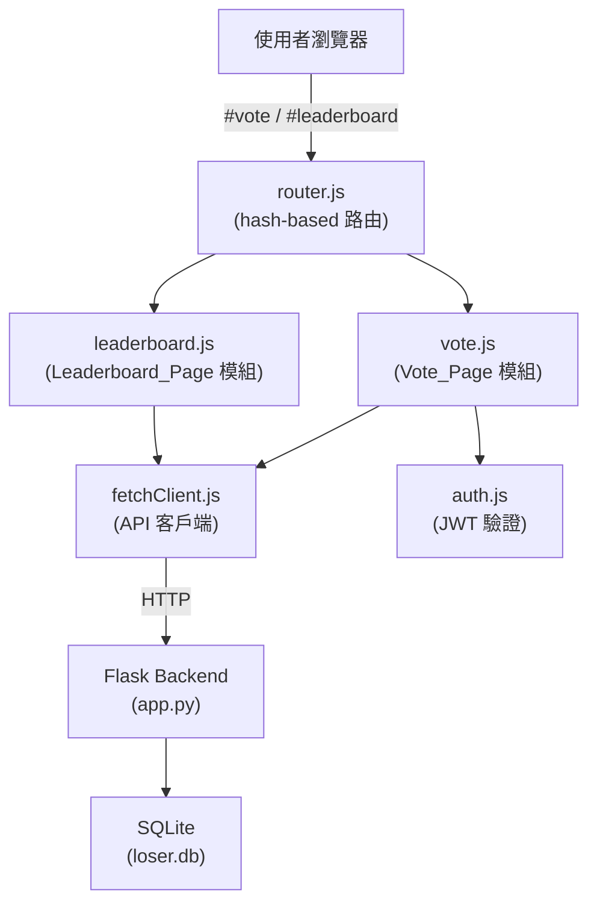
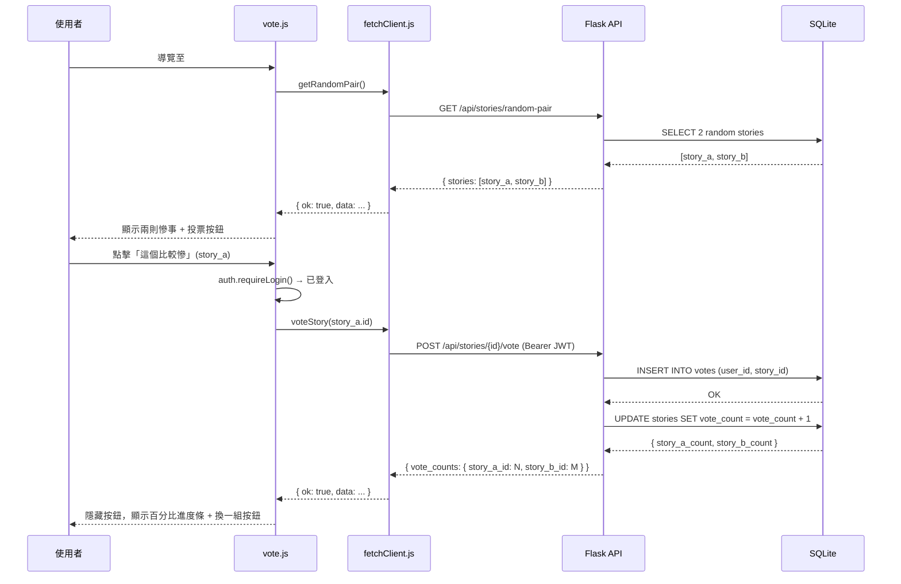
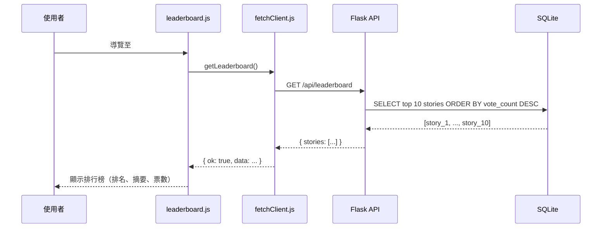

# Design Document: Misery Vote Battle（誰比較慘？投票對決）

## Overview

「誰比較慘？投票對決」為 TrashMatch 平台新增兩個頁面：`#vote`（投票對決）與 `#leaderboard`（慘度排行榜）。
前端以 Vanilla JS ES 模組實作，後端以 Python Flask 新增三支 API，資料庫新增 `votes` 表並為 `stories` 表加上 `vote_count` 欄位。
整體設計遵循現有程式碼慣例：hash-based 路由、JWT 驗證、`fetchClient.js` 統一呼叫 API。

## Architecture



## Sequence Diagrams

### 投票流程



### 排行榜流程



## Components and Interfaces

### Component 1: vote.js

**Purpose**: 管理 `#vote` 頁面的所有 UI 邏輯，包含載入隨機對決組、投票互動、百分比顯示。

**Interface**:
```javascript
export const vote = {
  init()      // 綁定事件、監聽路由切換
}
```

**Responsibilities**:
- 當頁面切換至 `#vote` 時，呼叫 `fetchClient.getRandomPair()` 載入兩則慘事
- 渲染兩則慘事卡片與「這個比較慘」按鈕
- 點擊投票按鈕時，先呼叫 `auth.requireLogin()`；未登入則跳轉 `#login`
- 投票成功後計算並顯示 `Vote_Percentage`，以進度條呈現
- 「換一組」按鈕重新觸發載入流程
- 處理慘事不足（< 2）的提示訊息

### Component 2: leaderboard.js

**Purpose**: 管理 `#leaderboard` 頁面的所有 UI 邏輯，包含載入排行榜資料與重新整理。

**Interface**:
```javascript
export const leaderboard = {
  init()      // 綁定事件、監聽路由切換
}
```

**Responsibilities**:
- 當頁面切換至 `#leaderboard` 時，呼叫 `fetchClient.getLeaderboard()` 載入前 10 名
- 渲染排行榜列表（排名、內容摘要最多 100 字、票數）
- 「重新整理」按鈕重新觸發載入流程
- 處理無票數資料的提示訊息

### Component 3: fetchClient.js（新增方法）

新增三個方法至現有 `fetchClient` 物件：

```javascript
// 取得兩則隨機對決慘事
async getRandomPair()
// → GET /api/stories/random-pair
// → { stories: [{ id, content, vote_count }, { id, content, vote_count }] }

// 對指定慘事投票（需 JWT）
async voteStory(storyId)
// → POST /api/stories/{storyId}/vote
// → { vote_counts: { [story_a_id]: N, [story_b_id]: M } }
// 注意：vote_counts 回傳的是本次對決兩則慘事的最新票數

// 取得排行榜
async getLeaderboard()
// → GET /api/leaderboard
// → { stories: [{ id, content, vote_count }, ...] }
```

### Component 4: router.js（修改）

**修改內容**：
- 在 `PAGE_MAP` 新增 `'#vote': 'vote-page'` 與 `'#leaderboard': 'leaderboard-page'`
- 在 `ALL_PAGES` 自動包含新頁面（由 `Object.values(PAGE_MAP)` 產生，無需額外修改）

### Component 5: Flask Backend（新增端點）

三支新 API，詳見「Key Functions with Formal Specifications」。

### Component 6: init_db.py（修改）

新增 `votes` 表，並為 `stories` 表新增 `vote_count` 欄位（透過 `migrate_db()` 遷移）。

## Data Models

### votes 表

```sql
CREATE TABLE IF NOT EXISTS votes (
    id         INTEGER PRIMARY KEY AUTOINCREMENT,
    user_id    INTEGER NOT NULL,
    story_id   INTEGER NOT NULL,
    created_at TIMESTAMP DEFAULT CURRENT_TIMESTAMP,
    FOREIGN KEY (user_id)  REFERENCES users(id),
    FOREIGN KEY (story_id) REFERENCES stories(id),
    UNIQUE (user_id, story_id)
)
```

**Validation Rules**:
- `UNIQUE(user_id, story_id)` 確保每位使用者對同一則慘事只能投票一次
- `user_id` 與 `story_id` 均為必填外鍵

### stories 表（新增欄位）

```sql
ALTER TABLE stories ADD COLUMN vote_count INTEGER NOT NULL DEFAULT 0
```

透過 `migrate_db()` 在啟動時自動執行，若欄位已存在則跳過。

### API 回應格式

```javascript
// GET /api/stories/random-pair
{
  "stories": [
    { "id": 1, "content": "今天被老闆罵...", "vote_count": 5 },
    { "id": 2, "content": "連外送都送錯...", "vote_count": 3 }
  ]
}

// POST /api/stories/<story_id>/vote（成功）
{
  "vote_counts": {
    "1": 6,
    "2": 3
  }
}

// POST /api/stories/<story_id>/vote（重複投票，409）
{
  "message": "你已經對這則慘事投過票了"
}

// GET /api/leaderboard
{
  "stories": [
    { "id": 1, "content": "今天被老闆罵...", "vote_count": 42 },
    ...
  ]
}
```

## Algorithmic Pseudocode

### GET /api/stories/random-pair

```pascal
PROCEDURE get_random_pair()
  OUTPUT: JSON response

  SEQUENCE
    stories ← SELECT id, content, vote_count FROM stories
    
    IF COUNT(stories) < 2 THEN
      RETURN HTTP 404, { message: "慘事數量不足，快去投稿吧！" }
    END IF
    
    pair ← SAMPLE 2 DISTINCT stories FROM stories (using random.sample)
    
    RETURN HTTP 200, {
      stories: [
        { id: pair[0].id, content: pair[0].content, vote_count: pair[0].vote_count },
        { id: pair[1].id, content: pair[1].content, vote_count: pair[1].vote_count }
      ]
    }
  END SEQUENCE
END PROCEDURE
```

**Preconditions:**
- `stories` 表存在且可讀取

**Postconditions:**
- 若成功，回傳恰好 2 則不重複的 Story
- 若 Story 數量 < 2，回傳 HTTP 404

### POST /api/stories/\<story_id\>/vote

```pascal
PROCEDURE vote_story(story_id)
  INPUT: story_id (URL param), JWT Bearer token (header)
  OUTPUT: JSON response

  SEQUENCE
    user ← get_current_user()  // 解析 JWT
    
    IF user IS NULL THEN
      RETURN HTTP 401, { message: "未登入或 token 已過期" }
    END IF
    
    story ← SELECT id FROM stories WHERE id = story_id
    
    IF story IS NULL THEN
      RETURN HTTP 404, { message: "慘事不存在" }
    END IF
    
    TRY
      INSERT INTO votes (user_id, story_id) VALUES (user.user_id, story_id)
      UPDATE stories SET vote_count = vote_count + 1 WHERE id = story_id
      COMMIT
    CATCH UNIQUE_CONSTRAINT_ERROR
      RETURN HTTP 409, { message: "你已經對這則慘事投過票了" }
    END TRY
    
    // 回傳本次對決兩則慘事的最新票數（story_id 由前端 query param 傳入）
    opponent_id ← request.args.get("opponent_id")
    counts ← {}
    counts[story_id] ← SELECT vote_count FROM stories WHERE id = story_id
    IF opponent_id IS NOT NULL THEN
      counts[opponent_id] ← SELECT vote_count FROM stories WHERE id = opponent_id
    END IF
    
    RETURN HTTP 200, { vote_counts: counts }
  END SEQUENCE
END PROCEDURE
```

**Preconditions:**
- 有效的 JWT Bearer token
- `story_id` 為正整數

**Postconditions:**
- 若成功，`votes` 表新增一筆記錄，`stories.vote_count` 加 1
- 若重複投票，資料庫不變，回傳 HTTP 409
- 若未登入，資料庫不變，回傳 HTTP 401

**Loop Invariants:** N/A

### GET /api/leaderboard

```pascal
PROCEDURE get_leaderboard()
  OUTPUT: JSON response

  SEQUENCE
    stories ← SELECT id, content, vote_count FROM stories
              ORDER BY vote_count DESC
              LIMIT 10
    
    RETURN HTTP 200, {
      stories: [
        { id: s.id, content: s.content, vote_count: s.vote_count }
        FOR s IN stories
      ]
    }
  END SEQUENCE
END PROCEDURE
```

**Preconditions:**
- `stories` 表存在且有 `vote_count` 欄位

**Postconditions:**
- 回傳最多 10 則 Story，依 `vote_count` 由高至低排序
- 若無資料，回傳空陣列 `[]`（HTTP 200）

### Vote_Percentage 計算（前端）

```pascal
PROCEDURE calculate_percentages(count_a, count_b)
  INPUT: count_a (integer), count_b (integer)
  OUTPUT: { pct_a, pct_b } (integers, sum = 100)

  SEQUENCE
    total ← count_a + count_b
    
    IF total = 0 THEN
      RETURN { pct_a: 50, pct_b: 50 }
    END IF
    
    pct_a ← ROUND(count_a / total * 100)
    pct_b ← 100 - pct_a  // 確保合計恰好 100%
    
    RETURN { pct_a, pct_b }
  END SEQUENCE
END PROCEDURE
```

**Preconditions:**
- `count_a >= 0`, `count_b >= 0`

**Postconditions:**
- `pct_a + pct_b = 100`（整數）
- 若 `total = 0`，兩者各為 50

## Key Functions with Formal Specifications

### `getRandomPair()` — fetchClient.js

```javascript
async getRandomPair()
// Returns: { ok: boolean, status: number, data: { stories: Story[] } | null }
```

**Preconditions:**
- `window.API_BASE_URL` 已設定

**Postconditions:**
- `ok === true` 時，`data.stories` 為長度 2 的陣列，兩則 Story 的 `id` 不重複
- `ok === false` 時（status 404），`data.message` 包含錯誤說明

### `voteStory(storyId, opponentId)` — fetchClient.js

```javascript
async voteStory(storyId, opponentId)
// Returns: { ok: boolean, status: number, data: { vote_counts: object } | null }
```

**Preconditions:**
- `storyId` 為正整數
- `opponentId` 為正整數（用於取得對手最新票數）
- `localStorage` 中存有有效 JWT token

**Postconditions:**
- `ok === true`（status 200）：`data.vote_counts` 包含 `storyId` 與 `opponentId` 的最新票數
- `ok === false`（status 401）：未登入
- `ok === false`（status 409）：已投票過
- `ok === false`（status 404）：慘事不存在

### `getLeaderboard()` — fetchClient.js

```javascript
async getLeaderboard()
// Returns: { ok: boolean, status: number, data: { stories: Story[] } | null }
```

**Postconditions:**
- `ok === true` 時，`data.stories` 為最多 10 則 Story 的陣列，依 `vote_count` 降序排列
- 若無資料，`data.stories` 為空陣列

## Example Usage

```javascript
// vote.js — 載入對決組
async function loadPair() {
  const result = await fetchClient.getRandomPair()
  if (!result.ok) {
    showMessage('目前慘事不足，快去投稿吧！')
    return
  }
  const [storyA, storyB] = result.data.stories
  renderPair(storyA, storyB)
}

// vote.js — 投票
async function handleVote(votedStoryId, opponentId) {
  if (!auth.requireLogin()) return  // 未登入 → 跳轉 #login

  const result = await fetchClient.voteStory(votedStoryId, opponentId)
  if (result.ok) {
    const counts = result.data.vote_counts
    const { pct_a, pct_b } = calculatePercentages(
      counts[storyA.id],
      counts[storyB.id]
    )
    showResults(pct_a, pct_b)
  } else if (result.status === 409) {
    showMessage('你已經對這則慘事投過票了')
  } else if (result.status === 401) {
    auth.requireLogin()
  }
}

// leaderboard.js — 載入排行榜
async function loadLeaderboard() {
  const result = await fetchClient.getLeaderboard()
  if (!result.ok) {
    showMessage('載入失敗，請稍後再試')
    return
  }
  if (result.data.stories.length === 0) {
    showMessage('還沒有人投票，快去 #vote 頁面開始比慘！')
    return
  }
  renderLeaderboard(result.data.stories)
}
```

## Error Handling

### Error Scenario 1: 慘事數量不足

**Condition**: `GET /api/stories/random-pair` 時資料庫 Story 數量 < 2
**Response**: HTTP 404，前端顯示「目前慘事不足，快去投稿吧！」，隱藏投票按鈕
**Recovery**: 使用者可前往 `#post` 頁面投稿後再回來

### Error Scenario 2: 重複投票

**Condition**: 同一使用者對同一 Story 再次投票
**Response**: HTTP 409，前端顯示「你已經對這則慘事投過票了」
**Recovery**: 使用者可點擊「換一組」繼續對決

### Error Scenario 3: 未登入投票

**Condition**: 未持有有效 JWT 的使用者點擊投票按鈕
**Response**: 前端呼叫 `auth.requireLogin()` 跳轉至 `#login`
**Recovery**: 登入後使用者可返回 `#vote` 繼續投票

### Error Scenario 4: 網路錯誤

**Condition**: API 呼叫失敗（`ok === false`, `status === 0`）
**Response**: 前端顯示「網路錯誤，請稍後再試」
**Recovery**: 使用者可重新整理頁面或稍後再試

## Testing Strategy

### Unit Testing Approach

- 測試 `calculatePercentages(count_a, count_b)` 的各種輸入組合
- 測試 `vote.js` 與 `leaderboard.js` 的 DOM 渲染函數（使用 jsdom 或 Playwright）
- 測試後端 API 端點（使用 pytest + Flask test client）

### Property-Based Testing Approach

**Property Test Library**: pytest + hypothesis（後端）

### Integration Testing Approach

- 測試完整投票流程：載入對決組 → 投票 → 顯示百分比
- 測試防重複投票機制
- 測試排行榜排序正確性

## Performance Considerations

- `GET /api/leaderboard` 使用 `ORDER BY vote_count DESC LIMIT 10`，建議在 `stories.vote_count` 上建立索引
- `GET /api/stories/random-pair` 使用 `random.sample()` 在 Python 層抽樣，避免 `ORDER BY RANDOM()` 的全表掃描（資料量小時可接受）
- 前端不做輪詢，排行榜僅在使用者主動切換頁面或點擊「重新整理」時更新

## Security Considerations

- 投票 API 使用現有 `get_current_user()` 驗證 JWT，與其他需要登入的端點一致
- `UNIQUE(user_id, story_id)` 約束在資料庫層強制防重複投票，即使並發請求也安全
- `opponent_id` 為選填 query param，後端僅用於查詢票數，不影響投票邏輯

## Dependencies

- 現有依賴：Flask、flask-cors、PyJWT、bcrypt、sqlite3（均已在 `requirements.txt`）
- 無需新增外部依賴

## Correctness Properties

*A property is a characteristic or behavior that should hold true across all valid executions of a system — essentially, a formal statement about what the system should do. Properties serve as the bridge between human-readable specifications and machine-verifiable correctness guarantees.*

### Property 1: 投票後票數單調遞增

*For any* 已登入使用者與任意 Story，成功投票後該 Story 的 `vote_count` 必須恰好比投票前多 1。

**Validates: Requirements 2.1, 6.1**

### Property 2: 防重複投票

*For any* 已登入使用者，對同一則 Story 投票兩次，第二次必須被拒絕（HTTP 409），且 `vote_count` 不變。

**Validates: Requirements 2.3, 6.3**

### Property 3: Vote_Percentage 合計恆為 100%

*For any* 兩個非負整數 `count_a` 與 `count_b`，`calculatePercentages(count_a, count_b)` 回傳的 `pct_a + pct_b` 必須等於 100。

**Validates: Requirements 4.1, 4.2**

### Property 4: random-pair 回傳不重複的兩則慘事

*For any* 包含至少 2 則 Story 的資料庫狀態，`GET /api/stories/random-pair` 回傳的兩則 Story 的 `id` 必須不相同。

**Validates: Requirements 1.1, 6.5**

### Property 5: 排行榜依票數降序排列

*For any* 資料庫狀態，`GET /api/leaderboard` 回傳的 Story 列表中，相鄰兩則的 `vote_count` 必須滿足 `stories[i].vote_count >= stories[i+1].vote_count`。

**Validates: Requirements 5.1, 6.6**
