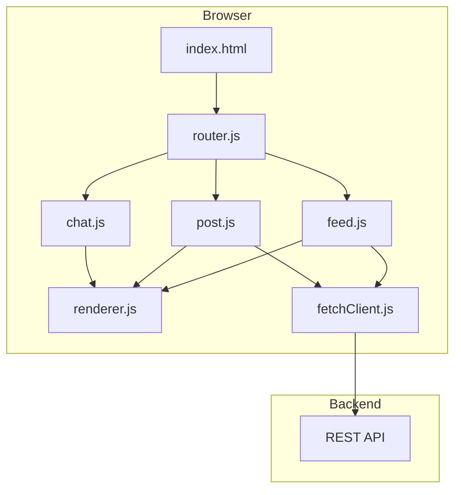
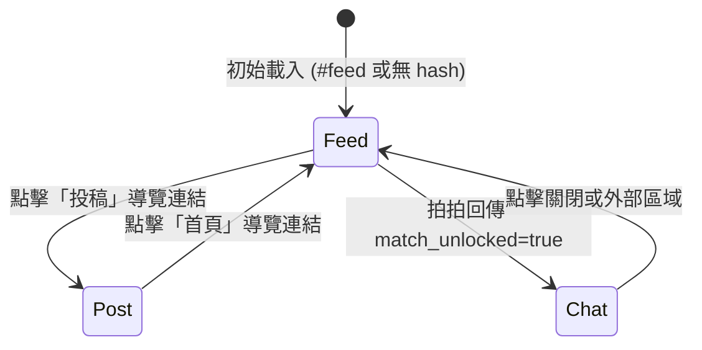

# 設計文件：衰鬼回收站 TrashMatch 前端

## 概覽

「衰鬼回收站 TrashMatch」前端是一個以「比慘」為核心互動機制的反向社交匿名平台前端實作。
採用純 HTML/CSS/Vanilla JavaScript（無框架），以毛玻璃（Glassmorphism）與像素風（Pixel Art）混搭的視覺風格，
透過 Fetch API 串接後端 REST API。

### 核心功能
- **Feed 頁**：隨機展示慘事卡片，支援拍拍互動
- **Post 頁**：投稿自己的慘事
- **Chat 面板**：配對成功後從右側滑入的聊天室佔位介面

### 技術選型
- **語言**：HTML5 / CSS3 / Vanilla JavaScript (ES6+)
- **路由**：Hash-based SPA 路由（`#feed`、`#post`）
- **API 通訊**：Fetch API（封裝為 Fetch_Client 模組）
- **樣式**：純 CSS，使用 CSS 自訂屬性（Custom Properties）管理設計 token
- **字型**：Google Fonts `Press Start 2P`（像素風）+ 系統 monospace fallback
- **測試**：Vitest（單元測試）+ fast-check（屬性測試）

---

## 架構

### 整體架構圖



### 頁面切換流程



---

## 元件與介面

### 模組結構

```
/
├── index.html          # 單一 HTML 入口，包含所有頁面容器
├── css/
│   ├── base.css        # Reset、CSS 變數、全域樣式
│   ├── components.css  # Story_Card、Pat_Button、Avatar 等元件樣式
│   ├── pages.css       # Feed、Post 頁面佈局
│   └── chat.css        # Chat_Panel 動畫與樣式
└── js/
    ├── fetchClient.js  # Fetch API 封裝模組
    ├── renderer.js     # DOM 渲染模組
    ├── router.js       # Hash 路由模組
    ├── feed.js         # Feed 頁邏輯
    ├── post.js         # Post 頁邏輯
    ├── chat.js         # Chat 面板邏輯
    └── main.js         # 應用程式進入點
```

### HTML 結構（index.html 骨架）

```html
<body>
  <nav id="nav-bar">...</nav>
  <main>
    <section id="feed-page" class="page">...</section>
    <section id="post-page" class="page hidden">...</section>
  </main>
  <aside id="chat-panel" class="chat-panel hidden">...</aside>
</body>
```

### 模組介面定義

#### fetchClient.js

```javascript
// 所有方法回傳 Promise<{ ok: boolean, status: number, data: any }>
export const fetchClient = {
  getRandomStory()           // GET /api/stories/random
  patStory(storyId)          // PUT /api/stories/<id>/pat
  postStory(content)         // POST /api/stories
}
```

#### renderer.js

```javascript
export const renderer = {
  renderStoryCard(story)     // 將 story 物件渲染至 #story-card
  renderError(container, msg) // 在指定容器顯示錯誤訊息
  renderSuccess(container, msg) // 在指定容器顯示成功訊息
  updatePatCount(count)      // 更新 #pat-count 顯示數值
  clearPostForm()            // 清空投稿表單
}
```

#### router.js

```javascript
export const router = {
  init()                     // 初始化路由，監聽 hashchange 事件
  navigate(hash)             // 切換至指定 hash 頁面
  openChat()                 // 觸發 Chat_Panel 滑入動畫
  closeChat()                // 觸發 Chat_Panel 滑出動畫
}
```

---

## 資料模型

### Story 物件（來自後端 API）

```javascript
// GET /api/stories/random 回傳
{
  id: string,          // 慘事唯一識別碼
  content: string,     // 慘事內容文字
  pat_count: number    // 目前拍拍數
}

// PUT /api/stories/<id>/pat 回傳
{
  pat_count: number,       // 更新後的拍拍數
  match_unlocked: boolean  // 是否觸發配對解鎖
}

// POST /api/stories 請求 body
{
  content: string  // 使用者輸入的慘事內容
}
```

### 前端內部狀態

```javascript
// feed.js 維護的頁面狀態
const feedState = {
  currentStory: Story | null,  // 目前顯示的慘事
  isPatting: boolean           // 拍拍請求進行中旗標
}

// post.js 維護的頁面狀態
const postState = {
  isSubmitting: boolean  // 投稿請求進行中旗標
}
```

### CSS 設計 Token（CSS 自訂屬性）

```css
:root {
  /* 色彩 */
  --color-bg: #0d0d1a;           /* 深紫藍背景 */
  --color-surface: rgba(255,255,255,0.08); /* 毛玻璃表面 */
  --color-border: rgba(255,255,255,0.15);  /* 毛玻璃邊框 */
  --color-accent: #7c3aed;       /* 主色調：紫色 */
  --color-text: #e2e8f0;         /* 主要文字 */
  --color-text-muted: #94a3b8;   /* 次要文字 */
  --color-error: #f87171;        /* 錯誤提示 */
  --color-success: #4ade80;      /* 成功提示 */

  /* 毛玻璃效果 */
  --glass-blur: blur(12px);
  --glass-radius: 12px;

  /* 像素風邊框 */
  --pixel-border: 3px solid var(--color-accent);

  /* 字型 */
  --font-pixel: 'Press Start 2P', monospace;
  --font-mono: 'Courier New', Courier, monospace;
}
```

---

## 正確性屬性

*屬性（Property）是指在系統所有合法執行情境下都應成立的特性或行為——本質上是對系統應做什麼的形式化陳述。屬性作為人類可讀規格與機器可驗證正確性保證之間的橋樑。*

### 屬性 1：Story_Card 渲染完整性

*對於任意* 合法的 Story 物件（包含 id、content、pat_count），呼叫 `renderer.renderStoryCard(story)` 後，DOM 中的 `#story-card` 元素應同時包含 content 文字與 pat_count 數值。

**驗證需求：需求 1.2**

### 屬性 2：空白內容投稿被拒絕

*對於任意* 僅由空白字元（空格、Tab、換行）組成的字串，嘗試投稿時應被拒絕，且投稿表單狀態保持不變（不呼叫 API）。

**驗證需求：需求 3.3**

### 屬性 3：拍拍數遞增不變式

*對於任意* 初始 pat_count 值，當 PUT /api/stories/<id>/pat 回傳成功時，Renderer 顯示的 pat_count 應等於初始值加 1。

**驗證需求：需求 2.2**

### 屬性 4：錯誤訊息渲染完整性

*對於任意* 錯誤訊息字串，呼叫 `renderer.renderError(container, msg)` 後，指定容器應包含該錯誤訊息文字。

**驗證需求：需求 1.4、2.5、3.5**

### 屬性 5：Hash 路由一致性

*對於任意* 合法的頁面 hash（`#feed`、`#post`），呼叫 `router.navigate(hash)` 後，`window.location.hash` 應等於該 hash，且對應頁面容器應可見，其他頁面容器應隱藏。

**驗證需求：需求 5.2、5.3、5.5**

---

## 錯誤處理

### API 錯誤處理策略

| 情境 | 處理方式 |
|------|----------|
| GET /api/stories/random 非 200 | 在 Story_Card 位置顯示「目前沒有慘事，快去投稿吧！」 |
| PUT /api/stories/<id>/pat 非 200 | 在 Pat_Button 旁顯示「拍拍失敗，請稍後再試」 |
| POST /api/stories 非 201 | 在 Post_Page 顯示「送出失敗，你的慘事暫時無人接收」 |
| 網路連線失敗（fetch 拋出例外） | 統一顯示「網路連線異常，請稍後再試」 |

### 防重複送出機制

- 拍拍請求進行中：Pat_Button 設為 `disabled`，請求完成後恢復
- 投稿請求進行中：送出按鈕設為 `disabled`，請求完成後恢復
- 使用 `finally` 區塊確保按鈕狀態一定被恢復，避免永久卡住

### fetchClient 錯誤封裝

```javascript
// fetchClient 統一回傳結構，不拋出例外
async function request(url, options) {
  try {
    const res = await fetch(url, options)
    const data = await res.json().catch(() => null)
    return { ok: res.ok, status: res.status, data }
  } catch (err) {
    return { ok: false, status: 0, data: null, error: err.message }
  }
}
```

---

## 測試策略

### 雙軌測試方法

本專案採用單元測試與屬性測試並行的策略：

- **單元測試（Vitest）**：驗證具體範例、邊界條件與錯誤情境
- **屬性測試（Vitest + fast-check）**：驗證跨輸入的通用屬性

### 屬性測試設定

- 每個屬性測試最少執行 **100 次迭代**
- 每個屬性測試以註解標記對應設計屬性：
  - 格式：`// Feature: trash-match-frontend, Property {N}: {property_text}`

### 測試範圍

#### 單元測試（fetchClient.js）
- 模擬 fetch 回傳各種狀態碼，驗證回傳結構正確
- 模擬網路例外，驗證錯誤封裝

#### 單元測試（renderer.js）
- 驗證 `renderStoryCard` 正確填入 content 與 pat_count
- 驗證 `renderError` / `renderSuccess` 正確插入訊息文字
- 驗證 `updatePatCount` 正確更新 DOM 數值

#### 屬性測試（renderer.js）
- **屬性 1**：對任意合法 Story 物件，`renderStoryCard` 後 DOM 包含完整資料
- **屬性 3**：對任意初始 pat_count，`updatePatCount(count + 1)` 後顯示值正確遞增
- **屬性 4**：對任意錯誤訊息字串，`renderError` 後容器包含該訊息

#### 屬性測試（router.js）
- **屬性 5**：對任意合法 hash，`navigate` 後 hash 與頁面可見性一致

#### 屬性測試（post.js 輸入驗證）
- **屬性 2**：對任意空白字串，驗證投稿被拒絕且 API 未被呼叫

#### 整合測試（手動 / E2E）
- Feed 頁完整流程：載入 → 顯示卡片 → 拍拍 → 配對解鎖 → Chat 面板滑入
- Post 頁完整流程：輸入 → 送出 → 成功提示 → 表單清空
- 路由切換：導覽列點擊 → hash 更新 → 頁面切換

### 不適用屬性測試的部分

以下部分不採用屬性測試，改用其他策略：

- **CSS 動畫與視覺樣式**（需求 4、7）：視覺回歸測試或人工驗收
- **Chat_Panel 靜態佔位介面**（需求 4.5）：單一範例測試
- **頭像 SVG/CSS 實作**（需求 6.3）：快照測試（snapshot test）
